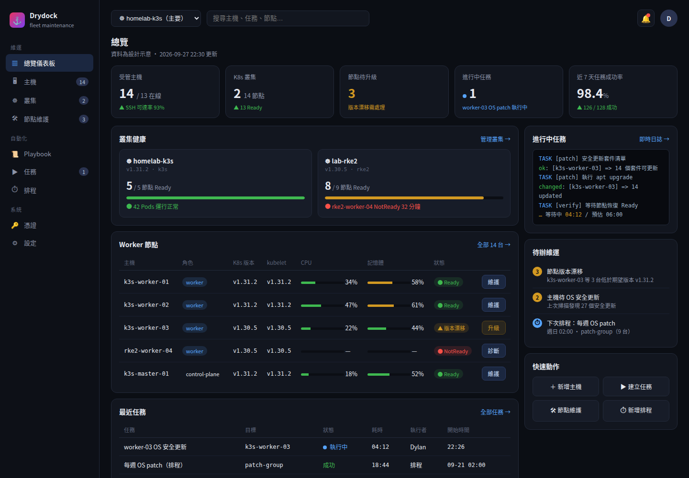

<p align="center"></p>

<h1 align="center">Drydock</h1>

<p align="center"><i>Bring your fleet in for servicing.</i></p>

<p align="center">A GUI over Ansible for remote server management, focused on <b>Kubernetes clusters and worker node operations</b> (OS patching, kubelet upgrades, cordon/drain orchestration).</p>

> Current stage: 🚧 under development (skeleton) — frontend/backend skeleton is connected: add hosts, run ping over SSH, watch the live log via WebSocket. Job Templates (M3) are in.



> Design mockups for the dashboard, job detail, node drawer and node maintenance flow live in [`doc/mockups/`](doc/mockups/) (HTML + PNG).

## Why this exists

Server operators juggle two disconnected toolsets:

- **Ansible GUIs** (AWX, Semaphore) run playbooks but can't see K8s node state
- **K8s management GUIs** (Rancher, Portainer, Headlamp) manage in-cluster resources but can't touch the OS layer

Something is missing in the middle: **an operations plane that knows K8s node state and can act on the OS layer with Ansible**. AWX is too heavy, Semaphore is too light with no K8s view — this project fills the gap.

## Quickstart

```bash
docker compose up --build
```

- Frontend: http://localhost:3000
- Backend API: http://localhost:8000 (`/docs` for Swagger)

Local development:

```bash
# backend
cd backend && pip install -r requirements.txt && uvicorn app.main:app --port 8000
# frontend
cd frontend && npm install && npm run dev   # http://localhost:5173, /api and /ws are proxied to the backend
```

## What works today (skeleton)

- Host inventory: add via UI (SSH keyscan probe), list, delete
- Playbooks: register inline YAML, browse, `ansible-playbook --syntax-check`
- Job Templates: bind playbook + hosts + extra_vars + check mode; launching a job freezes a snapshot
- Jobs: ad-hoc ping or launch from template; live event log over WebSocket
- Tests: `cd backend && python -m pytest tests/ -q`; E2E: `./scripts/e2e_smoke.sh`; CI runs on every push

## Docs

| Doc | Description |
|---|---|
| [doc/planning.md](doc/planning.md) | Product planning v0.1: positioning, case studies, module plan, tech architecture, roadmap |
| [doc/feature-list.md](doc/feature-list.md) | Detailed feature list (P0/P1/P2) |
| [doc/testing.md](doc/testing.md) | Test strategy: layers, CI, Definition of Done |
| [doc/modules/](doc/modules/) | Detailed spec per module (M1–M9) |
| [doc/mockups/dashboard.html](doc/mockups/dashboard.html) | Dashboard mockup (open in browser) |
| [doc/mockups/dashboard.png](doc/mockups/dashboard.png) | Dashboard mockup screenshot |

## Planned core features

- 🖥️ Host inventory (static + auto-sync of worker nodes from K8s)
- 📜 Playbook Git sync + Job Templates + ad-hoc commands
- ☸️ Multi-cluster node overview (versions, Ready state, resource usage)
- 🛠️ **One-click node maintenance workflow**: cordon → drain → patch/upgrade → verify → uncordon (one node at a time, stop on failure)
- 📊 Version drift detection, live task logs, approvals, scheduling, RBAC

## Roadmap

- **Phase 1 — MVP**: inventory + K8s node sync, Job Template execution, one-click node maintenance workflow; acceptance: a fully GUI-driven rolling OS patch across 3 workers in the homelab
- **Phase 2 — team-ready**: scheduling, approvals, RBAC, multi-cluster, drift detection, notifications
- **Phase 3 — hardening**: audit chain, capacity trends, AWX/Semaphore import tool

## Tech stack

| Layer | Choice |
|---|---|
| Frontend | React + TypeScript (Vite), Nginx-served static build |
| Backend | Python 3.12, FastAPI, official `ansible-runner`, SQLAlchemy |
| Database | PostgreSQL 16 |
| Queue (planned) | Redis / Celery for long-running jobs |
| Deploy | `docker compose up --build` — postgres + backend + frontend |

CI (`.github/workflows/ci.yml`) runs on every push/PR: backend `pytest` and frontend `npm run build`.

## Repository layout

```
├── backend/
│   ├── app/
│   │   ├── main.py            # FastAPI app: REST API + /ws/jobs/{jid} live log stream
│   │   ├── models.py          # SQLAlchemy models (hosts, playbooks, templates, jobs)
│   │   ├── db.py              # DB session / engine
│   │   ├── runner_service.py  # ansible-runner wrapper (background threads)
│   │   └── playbooks/         # built-in playbooks (e.g. ad-hoc ping)
│   ├── tests/                 # pytest API tests (CI-safe, no sshd needed)
│   ├── requirements.txt / requirements-dev.txt
│   └── Dockerfile
├── frontend/
│   ├── src/
│   │   ├── pages/             # Dashboard, Hosts, Playbooks, Templates, Jobs, JobDetail
│   │   ├── components/Layout.tsx
│   │   └── api.ts             # REST + WebSocket client
│   ├── nginx.conf             # serves dist/, proxies /api and /ws to backend
│   └── Dockerfile
├── doc/
│   ├── planning.md            # product planning v0.1
│   ├── feature-list.md        # P0/P1/P2 feature list
│   ├── testing.md             # test strategy
│   ├── modules/               # per-module specs (M1–M9)
│   └── mockups/               # dashboard/job/node-maintenance design mockups (HTML + PNG)
├── scripts/e2e_smoke.sh       # end-to-end smoke test (needs local sshd)
├── docker-compose.yml         # postgres + backend + frontend
└── .github/workflows/ci.yml
```
